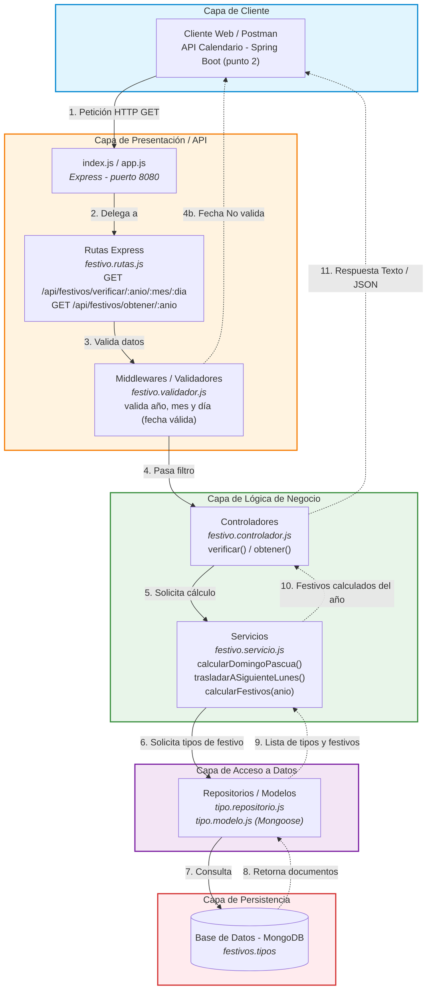
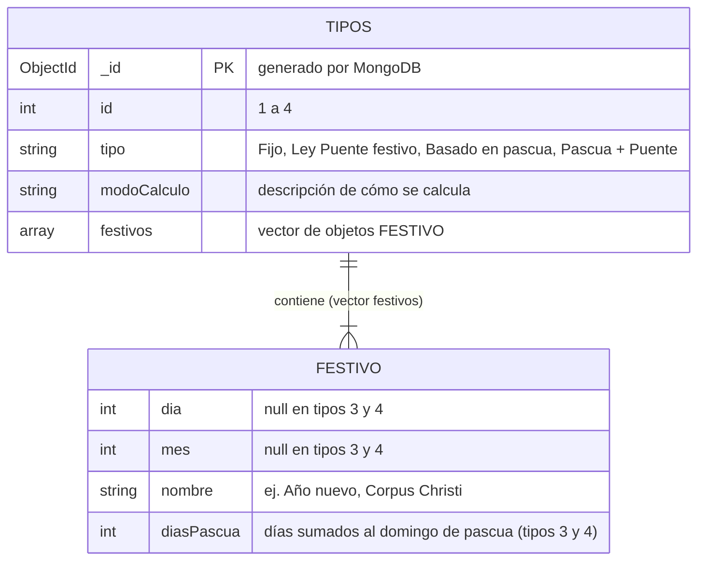

# Punto 1 – API RESTful Festivos (Express JS + MongoDB)

## Endpoints que expone la API

| Método | Ruta | Respuesta |
|---|---|---|
| GET | `/api/festivos/verificar/:anio/:mes/:dia` | Texto: `Es Festivo` / `No es festivo` / `Fecha No valida` |
| GET | `/api/festivos/obtener/:anio` | JSON: `[{ "festivo": "Año nuevo", "fecha": "2023-01-01" }, ...]` (lo consume la API del punto 2) |

---

## 1. Diagrama de Arquitectura por Capas



---

## 2. Diagrama de la Base de Datos (MongoDB)

Colección `tipos`: cada documento es un **tipo de festivo** y contiene el vector `festivos`.



### Documento de ejemplo

```json
{
  "id": 4,
  "tipo": "Basado en el domingo de pascua y Ley de \"Puente festivo\"",
  "modoCalculo": "Se suma diasPascua al domingo de pascua y se traslada al siguiente lunes",
  "festivos": [
    { "dia": null, "mes": null, "nombre": "Ascensión del Señor",      "diasPascua": 40 },
    { "dia": null, "mes": null, "nombre": "Corpus Christi",           "diasPascua": 61 },
    { "dia": null, "mes": null, "nombre": "Sagrado Corazón de Jesús", "diasPascua": 68 }
  ]
}
```
